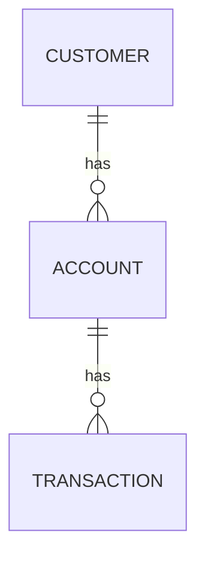

wallet - is a simple service which provides some APIs to handle wallet.

Assumptions:
- Customers can have multiple accounts with different types.
- An account must have only one owner.
- There are two types of accounts: **SAVINGS** and **CHECKING**. For a **SAVINGS** account, once you create it, you can only deposit money. For a **CHECKING** account, you can both withdraw and deposit money.
- A customer can have multiple transactions on their account.
- There are two types of transactions: **deposit** and **withdrawal**.
- A customer must be **verified** (KYC verification) before performing transactions.
- A customer can query the entire account balance 5 times a day.

